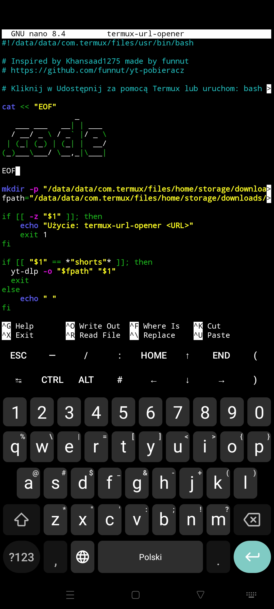

# yt-pobieracz

*Zainspirowany przez Khansaad1275 stworzony przez @funnut*

Nakładka programu yt-dlp do pobierania muzyki i filmów z sieci z twojego telefonu

## Instalacja

`bash
apt update && apt upgrade && cd && pkg install git -y && git clone https://github.com/funnut/yt-pobieracz.git && cd yt-pobieracz && bash install.sh
`

## Jak używać

***Udostępnij*** wideo lub muzykę za pomocą aplikacji ***Termux*** następnie wybierz format. 

Możesz też uruchomić ten sam skrypt podając odnośnik do wideo: 'bash ~/bin/termux-url-opener "www.linkdowideo.pl"'
